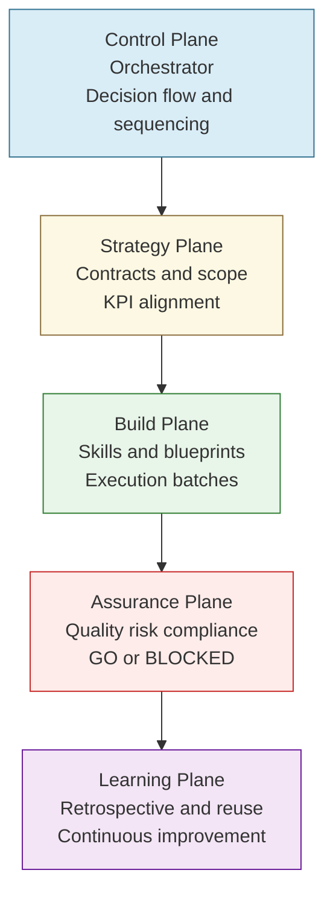
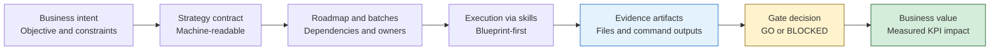
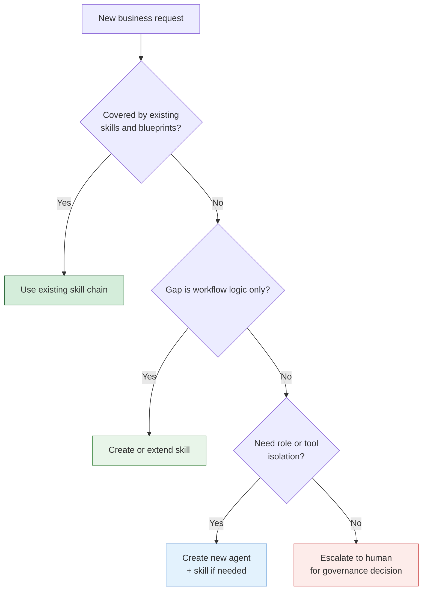
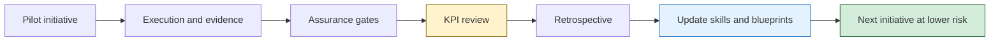

# Agentic Executive Diagrams

## Purpose

This pack contains executive-level diagrams to explain the agentic operating model
without technical noise. Use them in board updates, steering committees, and
transformation reviews.

## 1) Operating Model Stack (Who Decides What)

## 2) End-to-End Value Flow (From Intent to Verified Outcome)

## 3) Capability Triage (Do We Need New Skills or Agents?)

## 4) Governance Loop (How Scale Stays Under Control)

## Executive Talking Points

1. We are not automating tasks, we are standardizing decisions.
2. Evidence and gates are the control system, not optional documentation.
3. New capability requests are triaged before execution to avoid unmanaged risk.
4. Scale comes from blueprint and skill reuse, not from larger prompts.
