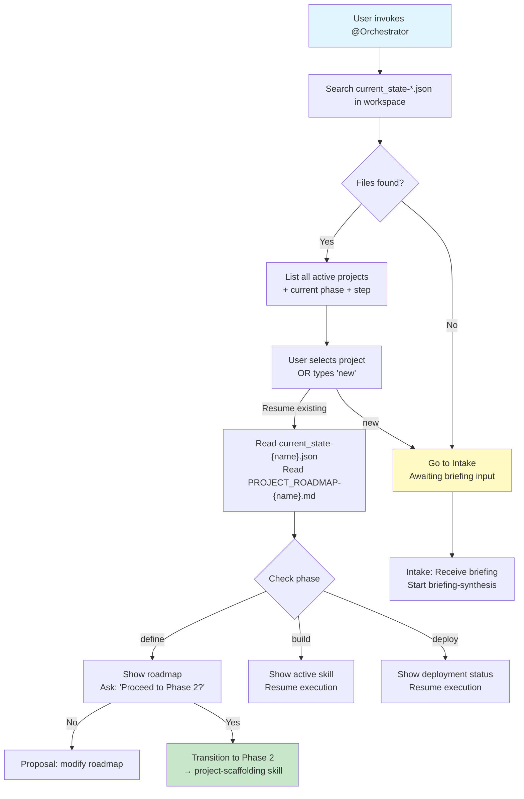
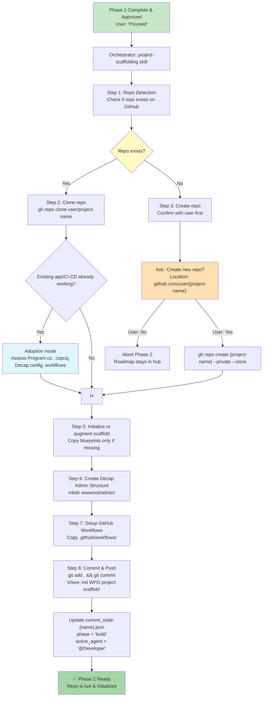
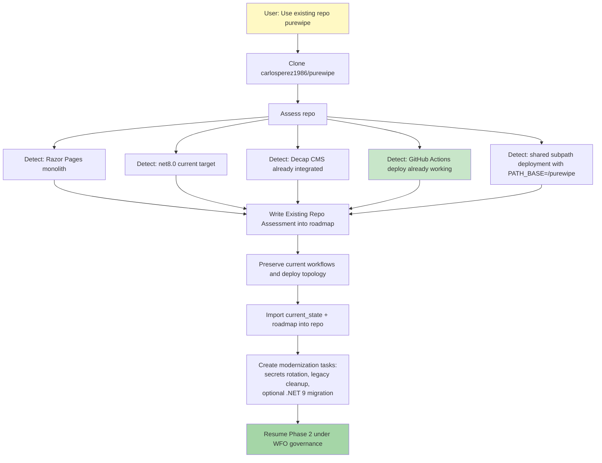
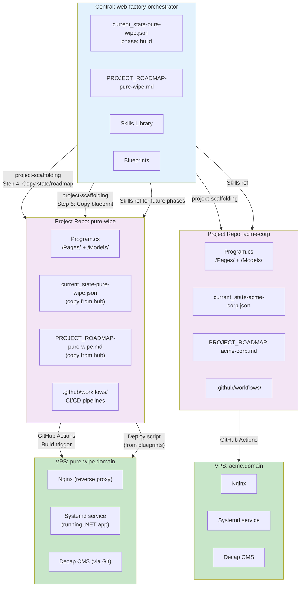
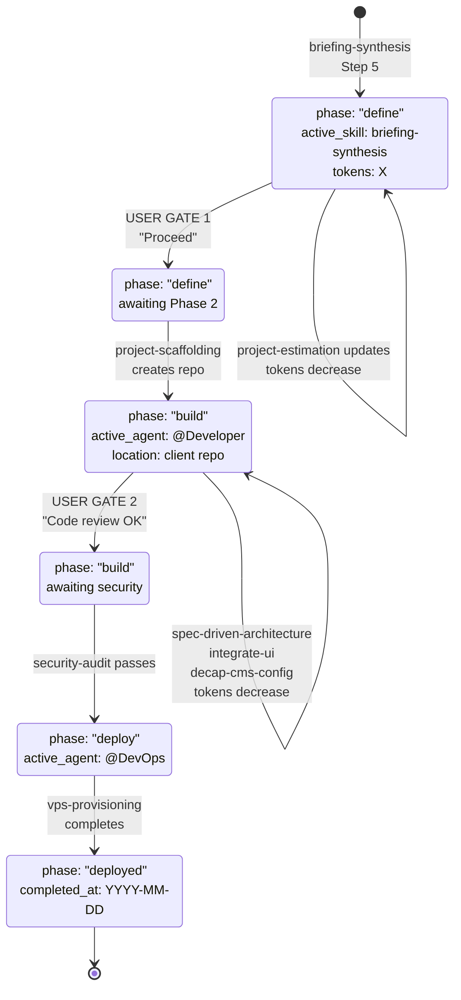

# WFO Visual Flowcharts

## Session Start Protocol



---

## Phase 2 Activation: Repository Detection & Creation



---

## Existing Repo Adoption Example: PureWipe



---

## Multi-Skill Pipeline (Full Journey)

```mermaid
flowchart LR
    A["briefing-synthesis<br/>Extract intent"] --> B["project-estimation<br/>Forecast cost/time"]
    B --> C["USER GATE 1<br/>Approve roadmap?"]
    C -->|Changes| D["Modify roadmap"]
    D --> B
    C -->|Proceed| E["project-scaffolding<br/>Create repo"]
    E --> F["spec-driven-architecture<br/>Generate specs"]
    F --> G["integrate-ui-component<br/>Build UI"]
    G --> H["decap-cms-config<br/>Admin setup"]
    H --> I["USER GATE 2<br/>Code review OK?"]
    I -->|No| J["Request changes"]
    J --> F
    I -->|Yes| K["security-audit<br/>CVE scan"]
    K --> L["vps-provisioning<br/>Deploy"]
    L --> M["✅ DEPLOYED"]
    
    C -->|phase: define| style C fill:#fff9c4
    E -->|phase: build| style E fill:#fff9c4
    K -->|phase: deploy| style K fill:#fff9c4
    M fill:#a5d6a7
```

---

## Central Hub + Distributed Repos (Deployment Model)



---

## current_state Lifecycle


