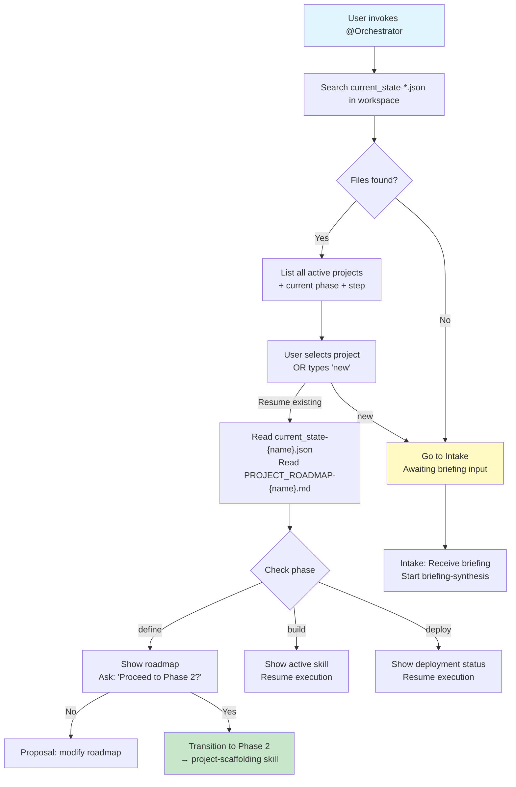
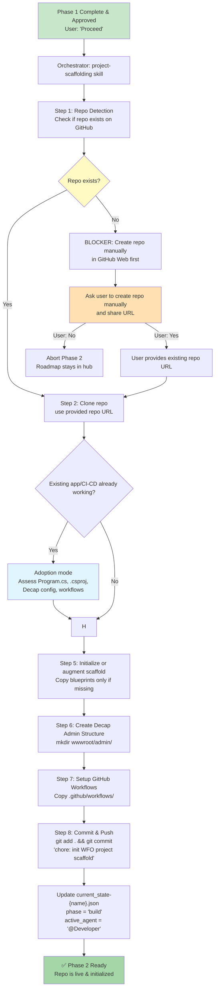
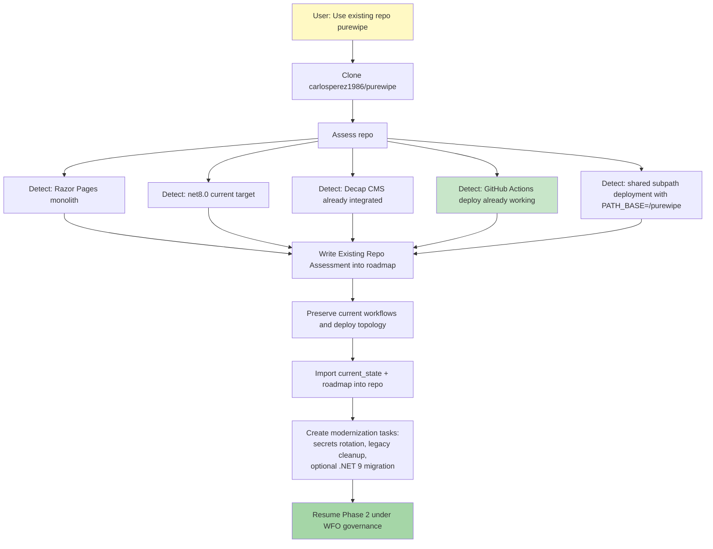
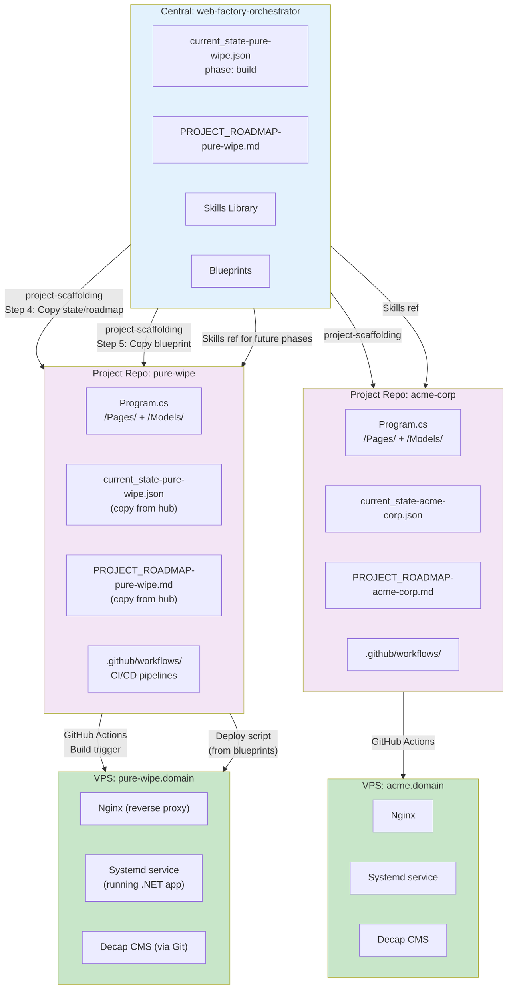
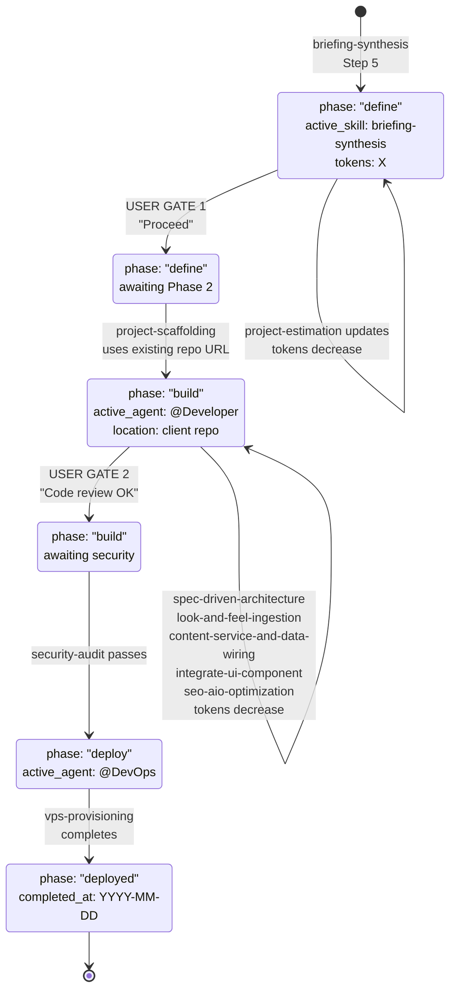
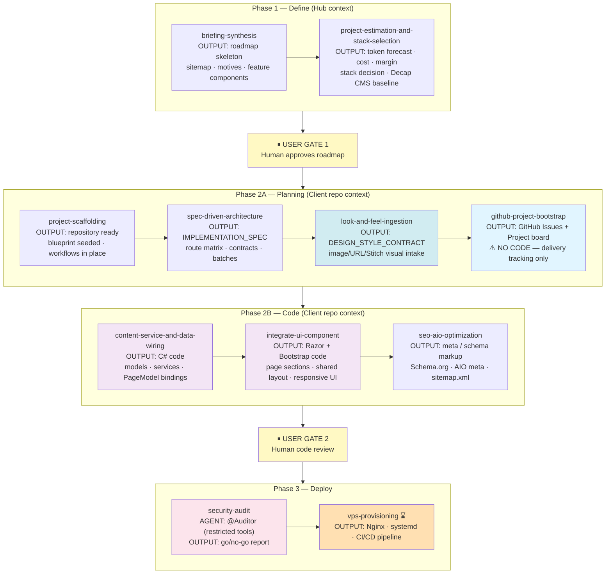
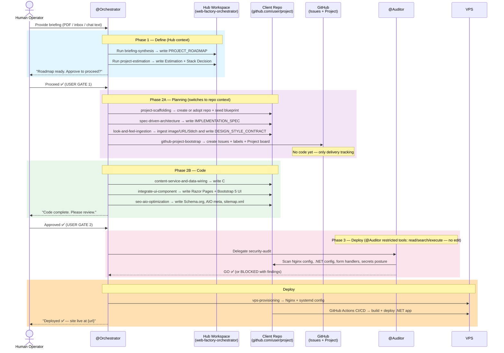

# WFO Visual Flowcharts

## Session Start Protocol

---

## Phase 2 Activation: Repository Detection (Manual Create Prerequisite)

---

## Existing Repo Adoption Example: PureWipe

---

## Multi-Skill Pipeline (Full Journey)

```mermaid
flowchart LR
    A["briefing-synthesis<br/>Extract intent<br/>→ roadmap skeleton"] --> B["project-estimation<br/>Forecast cost/time/tokens<br/>→ stack locked"]
    B --> C["USER GATE 1<br/>Approve roadmap?"]
    C -->|Changes| D["Modify roadmap"]
    D --> B
    C -->|Proceed| E["project-scaffolding<br/>Create or adopt repo<br/>→ repo ready"]
    E --> F["spec-driven-architecture<br/>Route matrix, contracts,<br/>component map, batches<br/>→ IMPLEMENTATION_SPEC"]
    F --> G["look-and-feel-ingestion<br/>Image/URL/Stitch input<br/>→ DESIGN_STYLE_CONTRACT"]
    G --> H["github-project-bootstrap<br/>GitHub Issues + labels<br/>+ Project board<br/>→ delivery tracking"]
    H --> I["content-service-and-data-wiring<br/>C# models + services<br/>+ PageModel bindings<br/>→ backend code"]
    I --> J["integrate-ui-component<br/>Razor Pages + Bootstrap 5<br/>+ responsive sections<br/>→ frontend code"]
    J --> K["seo-aio-optimization<br/>Schema.org + AIO meta<br/>+ sitemap.xml<br/>→ discoverability"]
    K --> L["USER GATE 2<br/>Code review OK?"]
    L -->|No| M["Request changes"]
    M --> I
    L -->|Yes| N["security-audit<br/>@Auditor — go/no-go<br/>CVE + config scan"]
    N --> O["vps-provisioning<br/>Nginx + systemd<br/>+ CI/CD deploy"]
    O --> P["✅ DEPLOYED"]

    style C fill:#fff9c4
    style L fill:#fff9c4
    style G fill:#d1ecf1
    style H fill:#e1f5ff
    style I fill:#f3e5f5
    style J fill:#f3e5f5
    style N fill:#fce4ec
    style P fill:#a5d6a7
```

---

## Central Hub + Distributed Repos (Deployment Model)

---

## current_state Lifecycle

---

## Build Phase: Skill Ownership and Output Type

---

## WFO Full Sequence: From Briefing to Deployed Site

